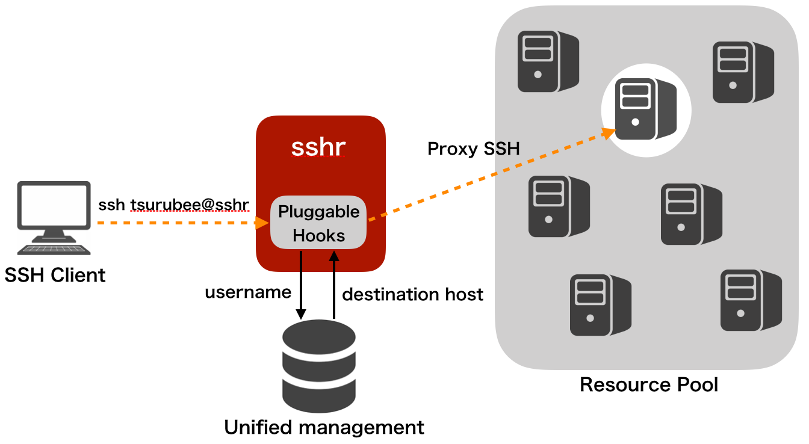

# sshr
[](https://travis-ci.org/tsurubee/sshr)  

sshr is an SSH proxy server whose client is not aware of the connection destination.  
A developer using sshr can freely incorporate own hooks that dynamically determines the destination host from the SSH username.  Therefore, for example, when the server administrator wants to centrally manage the linkage information between the SSH user and the server to be used in the DB, you can refer to the destination host from the DB with the hook that can be pluggable in sshr.

※ The main logic of sshr is implemented in [proxy.go](https://github.com/tsurubee/sshr.crypto/blob/master/ssh/proxy.go) of the [tsurubee/sshr.crypto](https://github.com/tsurubee/sshr.crypto) repository forked from [golang/crypto](https://github.com/golang/crypto).  



## Usage
### Installation
```
$ go get github.com/tsurubee/sshr
```

### Example
```go
func main() {
	confFile := "./example.toml"

	sshServer, err := sshr.NewSSHServer(confFile)
	if err != nil {
		fmt.Errorf("Error: %s", err)
	}

	sshServer.ProxyConfig.FindUpstreamHook = FindUpstreamByUsername
	if err := sshServer.ListenAndServe(); err != nil {
		fmt.Errorf("Error: %s", err)
	}
}

func FindUpstreamByUsername(username string) (string, error) {
	if username == "tsurubee" {
		return "host-tsurubee", nil
	} else {
		return "", errors.New(username + "'s host is not found!")
	}
}

```
FindUpstreamHook is a hook that can be pluggable, which allows you to write your own logic to dynamically determine the destination host from the SSH username.

### Quick start  
After Installation, test environment can be easily set up by using `docker-compose`.  
```
$ docker-compose up
・・・
ssh-proxy_1      | ==> Installing Dependencies
ssh-proxy_1      | go get -u github.com/golang/dep/...
host-tsurubee_1  | Starting crond: [  OK  ]
host-hoge_1      | Starting crond: [  OK  ]
ssh-proxy_1      | dep ensure
ssh-proxy_1      | go run main.go
ssh-proxy_1      | time="2018-09-22T09:23:00Z" level=info msg="Start Listening on [::]:2222"
```
The sshr server is listening on port 2222 of the localhost, and we can login to the server as `tsurubee` or `hoge` user like below.  (Password is `testpass`)
```
$ ssh tsurubee@127.0.0.1 -p 2222
tsurubee@127.0.0.1's password:
[tsurubee@host-tsurubee ~]$
```
We can also login with the public key authentication.  (At the first time, we need to change permissions by `chmod`)
```
$ chmod 600 ./misc/testdata/client_keys/id_rsa
$ ssh -i ./misc/testdata/client_keys/id_rsa tsurubee@127.0.0.1 -p 2222
Last login: Sat Sep 22 09:31:18 2018 from sshr_ssh-proxy_1.sshr_defaul
[tsurubee@host-tsurubee ~]$ 
```

### Pluggable Hooks
In order to be able to flexibly change the behavior of the proxy server, sshr can freely incorporate the following hooks.  

#### FindUpstreamHook（Required）
FindUpstreamHook is for specifying upstream host by SSH username.  
```
Type: func(username string) (string, error)
```

#### FetchAuthorizedKeysHook（Optional）
FetchAuthorizedKeysHook is for fetching authorized_keys to confirm registration of the client's public key.  
```
Type: func(username string, host string) ([]byte, error)
```
If not specified, `authorized_keys` is fetched from `/home/<username>/.ssh/`.  

#### FetchPrivateKeyHook（Optional）
FetchPrivateKeyHook is for fetching the private key used when sshr performs publickey authentication as a client user to the upstream host.  

```
Type: func(username string) ([]byte, error)
```
If not specified, privatekey whose file path is `/home/<username>/.ssh/id_rsa` is used.  

## Publications

1. H. Tsuruta and R. Matsumoto, “[sshr: An SSH Proxy Server Responsive to System Changes without Forcing Clients to Change](https://ieeexplore.ieee.org/document/9202744)”, in *The 15th IEEE International Workshop on Security, Trust & Privacy for Software Applications (STPSA 2020)*, July 2020.

## License

[MIT](https://github.com/tsurubee/sshr/blob/master/LICENSE)

## Author

[tsurubee](https://github.com/tsurubee)
